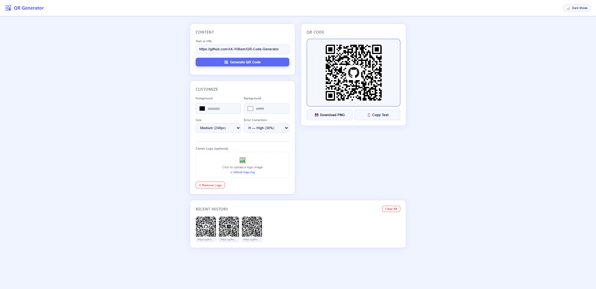

# 🔲 QR Code Generator

A clean and feature-rich QR Code Generator built with pure HTML, CSS and
Vanilla JavaScript. Generate QR codes instantly with custom colors, sizes
and even your own logo in the center — no backend, no API key needed.

---

## 📸 Screenshot



---

## ✨ Features

- 🔲 Instant QR code generation from any text or URL
- 🖼️ Upload your own logo / image to the center of the QR code
- 🎨 Custom foreground and background color picker
- 📐 QR size options — Small (160px) / Medium (240px) / Large (360px)
- 🛡️ Error correction level — L / M / Q / H
- 💾 Download QR code as PNG
- 📋 Copy text to clipboard
- 🕐 Recent history — last 5 generated QR codes (saved in localStorage)
- 🌙 Dark / Light mode toggle (preference saved across sessions)
- 📱 Fully responsive — works on mobile and desktop

---

## 🚀 How to Run

No installation needed!

1. Download or clone this repository
2. Open `index.html` in any modern browser
3. That's it!

```bash
git clone https://github.com/YOUR_USERNAME/QRCodeGenerator.git
cd QRCodeGenerator
# Just open index.html in your browser
```

---

## 📦 CDN Library

The project uses **QRCode.js** for QR code generation.

| Library | CDN URL |
|---|---|
| QRCode.js v1.0.0 | `https://cdnjs.cloudflare.com/ajax/libs/qrcodejs/1.0.0/qrcode.min.js` |

A local copy (`qrcode.min.js`) is included in this repository so the app
works **offline** without any internet connection. The `index.html` loads
the local file directly:

```html
<script src="qrcode.min.js"></script>
```

---

## 🛠️ Technologies Used

| Technology | Purpose |
|---|---|
| HTML5 | Page structure |
| CSS3 | Styling and responsive layout |
| Vanilla JavaScript | Logic and interactivity |
| QRCode.js | QR code generation |
| HTML5 Canvas API | Logo overlay on QR center |
| FileReader API | Handle image upload |
| localStorage | Save recent QR history and theme preference |

---

## 🖼️ How the Center Logo Works

QRCode.js generates the QR code on a `<canvas>` element. After generation,
the app uses the **HTML5 Canvas 2D API** to draw your uploaded logo on top
of the center of the QR code with a white padding box behind it.

Error correction level is automatically forced to **H (Highest)** when a
logo is present — this means up to 30% of the QR code can be covered and
it will still scan correctly.

Logo size is set to **20% of the QR width** — large enough to be visible,
small enough to keep the QR scannable.

---

## 📁 Project Structure

```
QRCodeGenerator/
├── index.html        # Main app — all HTML, CSS and JS in one file
├── qrcode.min.js     # Local copy of QRCode.js (downloaded from CDN)
├── screenshot.png    # Add your own screenshot here
└── README.md         # This file
```

---

## 📝 Code Structure (inside index.html)

The JavaScript is organised into clearly labelled sections:

```
// ===== SECTION: COLOR & SIZE OPTIONS =====
// ===== SECTION: LOGO OVERLAY =====
// ===== SECTION: QR GENERATION =====
// ===== SECTION: DOWNLOAD & COPY =====
// ===== SECTION: HISTORY =====
// ===== SECTION: DARK / LIGHT MODE =====
// ===== SECTION: TOAST =====
// ===== SECTION: EVENT LISTENERS =====
```

Every function has a JSDoc comment explaining what it does, and complex
lines have inline comments explaining *why*.

---

## 📄 License

MIT License — free to use, modify and distribute.
